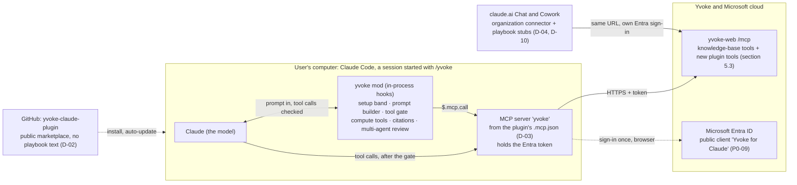

# Yvoke for Claude v1: design

How the plugin is built. Why it exists is in [intent.md](intent.md), what it must do is in
[requirements.md](requirements.md), and the tasks are in [plan.md](plan.md).

## 1. Architecture

### 1.1 What runs where



| Piece | What it is | What it does |
| --- | --- | --- |
| Marketplace repo | This repository, public (D-02) | Holds the plugin. Never holds playbook text, secrets or customer data. |
| Plugin `yvoke` | `plugin.json`, `.mcp.json`, mod, playbook stubs | The unit users install. Every setting lives in its `userConfig`; IT can preset them. |
| MCP connection | Server `yvoke` in `.mcp.json` | Claude Code's own connection to yvoke-web. Signs in through Entra and keeps the token. The model's tool calls and the mod's `$.mcp.call` both use it, so the mod never handles a token. |
| Mod | `hooks/register.tsx`, in-process in Claude Code | Everything Yvoke-specific in Claude Code (section 1.2). Active only in a session the user started with `/yvoke` (D-13). |
| yvoke-web | Spring server, MCP at `/mcp` | Source of truth for base instructions, playbooks, profiles and the knowledge base. Gets new MCP tools for the plugin (section 5). |
| Entra ID | New public client *Yvoke for Claude* | Signs Claude Code and the claude.ai connector in with the API scope the desktop uses. yvoke-desktop's registration and REST API stay unchanged. |
| Organization connector | Added by an admin on claude.ai (D-01) | Chat and Cowork reach the same `/mcp` URL through it; the playbook stubs depend on it. |

### 1.2 Runtime picture in Claude Code

```text
Claude Code engine (Desktop Code tab / terminal)
 ├─ skills/          playbook stubs for Chat and Cowork (D-04); loaded but not offered in Claude Code (D-11)
 ├─ MCP server yvoke from .mcp.json → search_corpus, get_section, verify_citations, …
 └─ mod (register.tsx), in-process hooks, only in a session started with /yvoke (P1-10):
     ├─ AbovePrompt      session setup band: area, mode, playbook; read-only once locked (P1-08)
     ├─ prompt.submit    playbook preflight; locks the session's setup on the first question
     ├─ prompt.compose   system prompt = base instructions + the session's playbook, from the server
     ├─ tool.call        deny by default; per-playbook scoping; web allow-list; compute tools
     ├─ turn.step        turn ceilings per question and role (P2-08)
     ├─ agent.spawn      specialist budget (P6-06)
     ├─ ui.render        citation links in replies; delegation cards; collapsed rejected drafts
     ├─ Pane             citation source panel
     ├─ turn.complete    enforced review rounds
     └─ $.mcp.call       every server call goes through the MCP server's own sign-in
```

After v1, `ui.render` adds 👍/👎 under replies, the pane a feedback comment form, and `turn.complete`
feedback and sync capture (D-07, D-08).

### 1.3 One question, start to finish

A single-agent question in Claude Code:

1. The user opens a session in any folder and types `/yvoke`. Until then, and in every session without it,
   the mod passes everything through (P1-10, D-13).
2. The setup band shows area, mode and playbook, filled from `list_areas` and `list_playbooks` (P1-08, P1-12).
3. The user sends a question. If the area has two or more playbooks, the preflight check may suggest another
   one; it fails open (P2-06).
4. The setup locks and shows read-only, also in the status line (D-11).
5. `prompt.compose` serves base instructions (`get_system_prompt`) followed by the playbook
   (`get_playbook`). A failed fetch drops the question with a `Yvoke Backend:` message (P1-07).
6. The model works. Every tool call passes `tool.call`; `turn.step` counts toward the turn ceiling
   (P2-01 – P2-05, P2-08).
7. The reply's citation markers become links; pressing one calls `get_section` and opens the source pane
   (P3-01 – P3-03).

In multi-agent mode, step 5 registers the profile's specialists and reviewer from `list_profiles` instead
of loading one playbook (D-06). The lead may only delegate, ask the user and verify citations;
`turn.complete` sends unapproved drafts back for revision up to the round limit (Phase 6).

In Chat and Cowork there is no mod: the user invokes a playbook stub, the stub tells Claude to call
`get_playbook` first, and Claude answers with the knowledge-base tools over the organization connector
(P8-01).

### 1.4 Planned repository layout

```text
yvoke-claude-plugin/
├── README.md
├── AGENTS.md                       ← rules for agents working in this repo
├── CLAUDE.md                       ← one line, `@AGENTS.md`, so the two cannot drift
├── .claude/                        ← agent harness: settings, hooks, skills (docs/sdlc.md)
├── .claude-plugin/marketplace.json ← the repo is its own marketplace
├── plugins/yvoke/
│   ├── .claude-plugin/plugin.json  ← name, version, userConfig, "types"
│   ├── .mcp.json                   ← Yvoke MCP server for Claude Code (D-03); Chat/Cowork use an org connector
│   ├── skills/<playbook>/SKILL.md  ← live stubs generated from the server's playbooks, Chat/Cowork only (P1-04, D-04)
│   ├── hooks/hooks.json            ← { "modules": ["./register.tsx"] }
│   ├── hooks/register.tsx          ← the mod entry point; wires the modules below
│   ├── src/                        ← server client, policy, setup, citations, orchestration, …
│   ├── types/index.d.ts            ← contract for $.state values
│   └── tests/*.test.ts             ← `claude plugin test plugins/yvoke`
├── scripts/                        ← docs check, skill stub generator, release helpers
├── deploy/                         ← managed-settings template for IT (P7-03)
├── docs/                           ← sdlc.md, specs/ (what is built), tasks/<release>/ (intent, requirements,
│                                     design, plan, one folder per task), user guide, security review
└── .github/workflows/              ← CI (P0-02), catalogue sync (P1-05)
```

No `agents/*.md`: profiles are registered live by the mod (D-06).

## 2. Platform constraints that shape the design

- The **mod API is early access** and changes between Claude Code releases. CI must run against the newest
  release (P0-02), and the minimum supported version is pinned (P7-07). Mods need **Claude Code ≥ v2.1.287**.
- **Mods are not sandboxed** and run with the user's permissions. `claude plugin validate` lists every API a
  mod calls; keep that list minimal (no `$.fs`, no `$.process`) so security review is easy (P7-06).
- A user can **disable the plugin**. That is accepted (D-09): using Yvoke is opt-in, so the mod's rules keep
  answers grounded for users who choose it, and are not a security boundary. No IT lockdown.
- If IT sets **`allowManagedModsOnly`**, mods installed from Git or claude.ai sync stop loading. Only a mod
  copied by MDM into an admin-only directory marketplace counts as the organization's (P7-04).
- In the Code tab, **no mod loads until the user trusts the session's folder**. Yvoke needs no special
  folder; any trusted folder works for Yvoke (P7-08).
- **A mod's hooks run in every session that loads the plugin.** Without scoping, deny-by-default and the
  playbook gate would block the user's other Claude Code work, such as coding. The mod enforces only in a
  session the user started with `/yvoke` (P1-10, D-13).

## 3. Decisions

Each decision blocks the tasks in [plan.md](plan.md) listed under it. Record the outcome and date under the box when ticking.

- [x] **D-01** `PO` — **Which Claude plans do users have?** Individual Pro/Max (as yvoke-desktop's spec
  assumes) or a Team/Enterprise organization?
  - Decides the distribution route: Pro/Max → Git marketplace, ideally pushed by MDM managed settings
    (route B); Team/Enterprise → claude.ai organization sync (route C) is also available.
  - Blocks: P7-03, P7-04.
  - **Install route decided 2026-10-05** (together with P7-04): the pilot installs from the Git
    marketplace (route A or B); rollout moves to an MDM-copied directory marketplace (route D) once IT
    enforces policy. Plugins from Git, a URL or claude.ai sync always run as *user* mods: they cannot be
    listed in `prependPlugins` and do not load under `allowManagedModsOnly`.
  - **Decided 2026-10-05 (Eduard): Team/Enterprise.** An admin adds the Yvoke connector for the organization
    (D-03, Chat/Cowork) and can push the plugin by claude.ai organization sync (route C). With no IT lockdown
    (D-09), route C is a simpler rollout than MDM (route D); P7-04 picks between them.
- [x] **D-02** `PO` · `IT` — **How do users get access to the marketplace repository?** Options: users' own
  GitHub access to a private repo; a public repo containing no playbook text; or yvoke-web serving
  `marketplace.json` and a plugin `archive` behind an auth header.
  - Recommendation: if D-04 chooses live playbooks, the repo holds no playbook text and can be public.
  - **Decided 2026-10-05 (Eduard): public repo.** It holds no playbook text (D-04); the knowledge stays on
    the server behind sign-in. Never commit playbook text, secrets or customer data here.
  - Blocks: P7-04.
- [x] **D-03** `server` · `plugin` — **How does Claude Code reach the Yvoke MCP server, and how does it sign
  in?** A claude.ai custom connector (already works in Claude sessions today), or a `.mcp.json` entry in the
  plugin using MCP OAuth against Entra ID.
  - The mod itself calls the server for live playbooks (P1-07), the citation pane (P3-03), feedback (P4) and
    sync (P5). Either route works for that: `$.mcp.call(server, …)` calls any server the session has
    connected, claude.ai connectors included, with the engine's own credentials; only `$.mcp.connect` is
    limited to servers the plugin's own manifest lists. Decide on sign-in, naming (a connector's name is not
    known at build time) and Chat/Cowork reach instead (review H3).
  - If the server is also offered as a claude.ai or organization connector, use the same URL in `.mcp.json`
    so users who have both see one set of tools.
  - **Decided 2026-10-05 (Eduard): plugin `.mcp.json` plus an organization connector.** Claude Code uses the
    plugin's own `.mcp.json` entry (fixed server name, so the mod knows its tool prefix), signing in through
    the "Yvoke for Claude" Entra client (P0-09, section 5.2). Chat and Cowork use an organization claude.ai
    connector with the same URL, which the D-10 stubs need. One URL, so users with both see one set of tools.
  - Depends on: P0-04 findings.
  - Blocks: P1-01, P1-02.
- [x] **D-04** `PO` — **Playbooks: live or copied?** Live: skill stubs (name and description only) are
  generated, and the mod fetches each playbook's text when it is invoked (needs server task P1-06). Copied:
  full `SKILL.md` text generated into the repo by a scheduled job.
  - Recommendation: **live**, to keep yvoke-desktop's "no stale instructions" rule. Copied text also
    works in Chat and Cowork, where no mod runs, so Chat/Cowork may need copied text either way (see P8-01).
  - **Claude Code is settled by D-11** (live, through the mod, no skills). This decision now covers only
    Chat and Cowork.
  - **Decided 2026-10-05: live stubs everywhere.** Each generated Chat/Cowork skill holds only the
    playbook's name and description and tells Claude to call `get_playbook` with that name first and follow
    what it returns. No playbook text is ever committed, so the public repo stays public (D-02). Risk: in
    Chat and Cowork nothing enforces the call; if P0-08 shows the model skipping it, fall back to copied text
    in a separate private marketplace.
  - Blocks: P1-04, P1-05.
- [x] **D-05** `plugin` — **Naming.** The plugin name is user-facing (`/yvoke:<skill>`) and prefixes the
  mod's own tools (`mcp__<plugin>__<tool>`). The server's tool names differ by how it is reached: a server
  in the plugin's `.mcp.json` is `plugin:<plugin>:<server>` with tools `mcp__plugin_<plugin>_<server>__<tool>`;
  a claude.ai connector gets a connector-specific name (in the Desktop Code tab, `mcp__<uuid>__<tool>`).
  Neither collides with the mod's tools, so the plugin can simply be named `yvoke`.
  🔍 Confirm the names on each surface (P0-04).
  - **Decided 2026-10-05 (Eduard): plugin `yvoke`, server `yvoke` in `.mcp.json`.** Claude Code tool names are
    `mcp__plugin_yvoke_yvoke__<tool>` (e.g. `mcp__plugin_yvoke_yvoke__search_corpus`); commands are
    `/yvoke:<name>`. Do not rename after rollout: users' permission rules use these names.
  - Blocks: P2-04, P2-05.
- [x] **D-06** `PO` · `plugin` — **Multi-agent profiles: registered live by the mod (`$.agent.register`)
  or generated into `agents/*.md`?** Live keeps the server as source of truth and works only in Claude Code;
  generated files also work in Cowork.
  - Generated files fix `model`, `effort` and `tools` at build time. Role models and budgets from deployment
    configuration (P6-02) need live registration. 🔍 Unless agent files accept `${user_config.*}`.
  - **Decided 2026-10-05 (Eduard): live.** When multi-agent mode is chosen in the setup band, the mod reads
    the profile from the server and registers its specialists and reviewer with `$.agent.register`. Role
    models and budgets come from server configuration. No `agents/*.md` are generated (multi-agent is Claude
    Code only, D-10).
  - Depends on: P0-07.
  - Blocks: P6-01.
- [x] **D-07** `PO` — **Should conversations be synced into the user's Yvoke account** (as Yvoke Desktop
  does), or stay only in Claude? This affects privacy review, server work, and whether feedback can attach to
  a server message id.
  - Privacy: sync's retry queue (P5-02) keeps questions and answers unencrypted in `$.store` on disk until
    they are sent, the same class of issue as yvoke-desktop decision #10.
  - **Decided 2026-10-05 (Eduard): no sync in v1.** Conversations stay in Claude's own history. Phase 5 and
    the server's sync tools move after v1, and rating follows sync (D-08).
  - Blocks: all of Phase 5.
- [x] **D-08** `PO` · `server` — **Feedback shape.** Yvoke Desktop's feedback is keyed to a server message
  id that only exists because it syncs conversations. Without sync (D-07), feedback must be self-contained:
  rating, comment, question, answer, playbook, cited ids, model, client and plugin version.
  - Recommendation: **always self-contained**, whatever D-07 decides. If sync is added later, P5-04 adds
    the server's message id to the same payload. Phase 4 then does not wait on D-07.
  - **Decided 2026-10-05 (Eduard): rating comes after sync.** No rating in v1. Phase 4 is built after
    Phase 5, and a rating attaches to the synced message id as in yvoke-desktop, so `submit_feedback` wraps
    the existing feedback store and needs no new storage. The self-contained payload is not built.
  - Blocks: P4-01.
- [x] **D-09** `IT` — **Lockdown level.** Mod-only enforcement (user can disable the plugin), or managed
  settings that deny `Bash`, `Write`, `Edit`, etc. on consultant machines.
  - Managed `permissions.deny` applies to every Claude Code session on the machine, not only the Yvoke
    folder. It suits consultant-only machines. On machines where users also code with Claude Code, the
    options are mod-only enforcement, or an organization-managed policy mod (`prependPlugins`) that applies
    the deny only in Yvoke sessions. 🔍 Confirm whether users can disable a managed policy mod.
  - **Decided 2026-10-05 (Eduard): mod only, no IT lockdown.** Users opt in by installing the plugin and
    starting Yvoke sessions; Claude Code's own permission prompts still guard shell and file tools. The
    mod's in-session rules (P2-01 to P2-03) stay, as answer quality rather than security. P2-07 is dropped.
  - Blocks: P2-07.
- [x] **D-10** `PO` — **Is Chat/Cowork support in scope for v1**, or Claude Code only?
  - **Decided 2026-10-05 (Eduard): Claude Code plus playbook stubs.** v1 is built for Claude Code. Chat and
    Cowork get only the live playbook stubs (P8-01) over the Yvoke connector: knowledge-base answers with a
    playbook, but no setup band, scoping, rating or multi-agent mode there. P8-02 to P8-04 move after v1.
  - Blocks: Phase 8.
- [x] **D-11** `PO` · `plugin` — **In Claude Code, are playbooks skills or mod state?**
  - **Decided 2026-10-05 (Eduard): mod state, chosen once per session.** A small Yvoke UI in the session
    selects the **area** (default OIM), the **mode** (single agent or multi-agent; OIM offers both) and, for
    single agent, the **playbook** (default `oim-full`). The agent's system prompt is the base instructions
    loaded from the server, with the playbook's text added to it. Once chosen, area, mode and playbook cannot
    change for that session, and all three stay visible in it.
  - Consequences: no playbook skills in Claude Code (they stay for Chat/Cowork, P1-04, P8-01); the list of
    areas and playbooks is read live from the server; nothing to restore or switch mid-conversation; the
    model cannot start a playbook by itself.
  - Blocks: P1-08, P1-07, P1-12.
- [x] **D-12** `PO` · `server` — **Base instructions: MCP server `instructions` or a tool?**
  - The plugin's MCP server loads in every Claude Code session, so server `instructions` would also reach
    users' coding sessions, and Yvoke sessions would get them twice (once more from P1-07).
  - **Decided 2026-10-05 (Eduard): tool only.** yvoke-web serves the base instructions through
    `get_system_prompt` and not as MCP `instructions`. The mod adds them in Yvoke sessions (P1-07); Chat and
    Cowork stubs fetch them (P8-01).
  - Blocks: P1-01.
- [x] **D-13** `PO` · `plugin` — **Where does Yvoke work, and how does a session become a Yvoke session?**
  Until now the mod applied only inside a configured Yvoke folder.
  - **Decided 2026-10-05 (Eduard): any folder, started with `/yvoke`.** There is no Yvoke folder. A session
    is plain Claude Code until the user types `/yvoke`; from then on the setup band, system prompt and tool
    rules apply to that session until `/clear`. `/resume` and `/branch` keep it a Yvoke session.
  - Default chosen with it: `/yvoke` works only before the session's first question. In a session that
    already has turns it tells the user to `/clear` first, so Yvoke answers never build on coding turns.
  - Replaces the folder setting and the path matching in P1-10; P7-08 only covers folder trust.
  - Blocks: P1-10.
- [x] **D-14** `PO` · `plugin` — **Is the server URL fixed in `.mcp.json`, or a setting?** A developer needs
  to point the plugin at a local yvoke-web (P0-11).
  - **Decided 2026-10-05 (Eduard): a setting.** `.mcp.json` reads the URL from `${user_config.serverUrl}`,
    which defaults to the production URL. A developer sets `http://localhost:<port>/mcp`. Chat and Cowork
    use the organization connector (D-03), not the plugin's `.mcp.json`, so the setting does not affect
    them. The server keeps the name `yvoke`, so tool names (D-05) stay the same.
  - **Dev sign-in, decided 2026-10-06 (Eduard) in P0-11:** a `devMode` switch in `userConfig`, not a dev
    token. The plugin always sends `X-Yvoke-Dev-Mode: true|false`; yvoke-web accepts `true` only in mock
    mode. It cannot be an `Authorization` header: Claude Code turns the OAuth sign-in off whenever
    `.mcp.json` sets one, even empty. `serverUrl` has no default until P1-02 adds the production URL.
  - Blocks: P0-11, P1-02.
- [x] **D-15** `PO` · `server` — **What is an area?** D-11 introduced the area; yvoke-web already has
  multi-agent profiles, each one a knowledge base such as OIM or PingID with its own orchestrator, reviewer
  and specialist playbooks (`OrchestratorProperties`).
  - **Decided 2026-10-05 (Eduard): an area is that knowledge base.** Each area offers *Single agent* plus
    its one multi-agent profile. `list_areas` adds only each area's playbooks and its default playbook.
    Today there is one area (OIM); more will follow, so nothing may assume a single area.
  - Blocks: P1-12.
- [x] **D-16** `PO` · `server` — **Which prompt are the single-agent base instructions?** yvoke-web has a
  stored prompt named `default-chat` and, separately, the prompt an admin marks as the *Active Default
  Chat System Prompt* on the admin page. They are usually the same; they differ once an admin picks
  another one. The desktop's REST endpoint lets the `default-chat` row win.
  - **Decided 2026-10-06 (Eduard): the one marked as Active Default Chat System Prompt.**
    `get_system_prompt` with no name (or `default-chat`) returns it, as yvoke-web's own single-agent mode
    does. Multi-agent roles get their own system prompts with the profiles (P6-01), not from this tool.
  - Delivered by: P1-01.

## 4. Notes for implementers

Read this before you pick up a task, whether you are a person or an agent. It holds what you would otherwise
rediscover. Facts were checked against **Claude Code 2.1.289** on 2026-10-05. The mod API is early access,
so where this section and the generated declarations disagree, the declarations win. Fix this section in
the same PR.

### 4.1 Where things are

- **yvoke-desktop** is public: `git clone https://github.com/yvoke-dev/yvoke-desktop`. It is an Electron app
  built on the **Claude Agent SDK** (`@anthropic-ai/claude-agent-sdk`), so its policy is a `canUseTool`
  callback plus `allowedTools`. Here the same rules become a `tool.call` hook.

  | Plan says | Path in yvoke-desktop |
  | --- | --- |
  | `policy.ts` (`isToolAllowed`, `buildAllowedTools`, `isUrlDomainAllowed`, `WAF_CHALLENGED_HOSTS`) | `src/main/agent/policy.ts` |
  | `DEFAULT_KB_TOOLS`, `qualifyTool`, `MCP_TOOL_PREFIX`, `builtinTool` | `src/shared/types.ts` |
  | `McpPrompts.callGetSection`, `_meta` playbook mapping | `src/main/agent/McpPrompts.ts` |
  | `computeTools.ts` | `src/main/agent/computeTools.ts` (served by `computeServer.ts`) |
  | `citationRehype.ts`, citation pane | `src/renderer/src/components/citationRehype.ts`, `CitationModal.tsx`, `sectionView.ts` |
  | `mapSpecialistTools`, `REVIEW_FEEDBACK_HEADING`, `EVIDENCE_HEADING`, verdict parsing | `src/main/agent/orchestration.ts` |
  | Preflight check | `src/main/agent/playbookValidation.ts`, `PlaybookValidator.ts` |
  | Tests named in this plan | `tests/<name>.test.ts` (vitest) |
  | Functional spec chapters | `spec/01_…` – `spec/08_…` |
  | Agent rules to carry over (TDD, known pitfalls) | `CLAUDE.md` and `.agents/AGENTS.md` |

- **The Yvoke MCP server** today exposes `search_corpus`, `get_section`, `get_toc`, `list_documents`,
  `get_graph_neighbors`, `search_graph_entities`, `query_json_objects`, `get_json_schema`,
  `verify_citations` and `ask_clarifying_question`. `get_system_prompt` is added by P1-01
  ([yvoke-web#5](https://github.com/yvoke-dev/yvoke-web/pull/5)), and `list_playbooks` and `get_playbook`
  by P1-06 ([yvoke-web#4](https://github.com/yvoke-dev/yvoke-web/pull/4)). `list_areas`, `list_profiles`,
  `submit_feedback` and the sync tools do not exist yet (P1-12, P6-01, P4-01, P5-01). Server code lives in `yvoke-dev/yvoke-web`.
- **What yvoke-desktop reads over REST, and the plugin's route for it.** The desktop calls yvoke-web's REST
  API (`/api/chat/v1`, `SyncClient.ts`) with its own Entra bearer token, and reads playbooks as MCP
  *prompts*. The mod has neither: Claude Code keeps the connector's token to itself, the only other key
  yvoke-web accepts is the shared ingest machine key (`ApiKeyAuthenticationFilter`, `ROLE_INGEST`), which
  must never ship to users, and the mod API cannot read MCP prompts. So every one of these becomes an MCP
  tool on yvoke-web, authenticated by the connector's sign-in. Each is a thin wrapper: yvoke-web's MCP tools
  are Spring AI `@Tool` classes in `src/main/java/de/palsoftware/yvoke/mcp/tools/`, and
  `chat/api/DesktopSyncController.java` already holds the logic.

  | yvoke-desktop call | Plugin route | Task |
  | --- | --- | --- |
  | `GET /prompts/system/default-chat` (base instructions) | `get_system_prompt` tool (D-12) | P1-01 |
  | MCP `prompts/list` + `prompts/get` (playbooks) | `list_playbooks` / `get_playbook` tools (with areas) | P1-06, P1-12 |
  | `GET /orchestrator/profiles` | `list_profiles` / `get_profile` tools | P6-01 |
  | `PUT /messages/{id}/feedback` | `submit_feedback` tool, keyed to the synced message id (D-08; after v1) | P4-01 |
  | `/conversations…`, `/messages`, `POST /orchestrator/runs` | sync and trace tools, only if D-07 says yes | P5-01 |

  Worst case, if a server tool cannot be added in time: the read-only configuration (base instructions,
  playbooks, profiles) can be generated into the repository by a scheduled job (P1-05's mechanism). The repo
  is public, it goes stale between runs, and it breaks yvoke-desktop decision #14. Feedback and sync have no
  such fallback. A sign-in of the mod's own (Entra device-code flow over `$.http.fetch`) is possible but
  rejected: it would keep a refresh token in plain JSON in `$.store`.

### 4.2 The mod API: where the truth is

- Run `claude --version` and note it in your spike or PR. The declarations for **your** build are written by
  the engine: once a mod has loaded from a folder you own (`--plugin-dir`, `CLAUDE_CODE_PLUGIN_DIRS`), see
  `plugins/yvoke/.claude-plugin/types/claude-code/index.d.ts` (about 20,000 lines; grep for `'tool.call'`,
  `HookBudget` and so on). Do not commit that `types/` folder; it is regenerated on every load.
  `validate` and `test` do not write it; `npm run types` (`scripts/lay-types.mjs`) loads the mod once in
  print mode, with no sign-in and no model call, to lay it before `tsc` runs (P0-01).
- `claude plugin validate plugins/yvoke` prints the `hooks:` and `calls:` lines the security review (P7-06)
  needs, and refuses source the engine could not read. Run it before every push.
- `claude plugin test plugins/yvoke` runs `*.test.ts` against the real engine with no session, network, fs
  or process. Import `test`, `expect` and `mock` from `claude-code/testing`. Hooks a test registers sit
  *beneath* the plugin and stand for the engine, so stub the Yvoke server by hooking `mcp.call` in the test:
  `on('mcp.call', () => ({ content: [{ type: 'text', text: '…' }], isError: false }))`. UI tests mount on a
  surface the test names. Loop every UI test over `['terminal', 'desktop'] as const`.

### 4.3 Plan concept → mod API

| Plan uses | API (2.1.289) | Notes |
| --- | --- | --- |
| Deny a tool | `on('tool.call', h)` → `{ deny: reason }` | `e.tool` is the full name; `e.agentId` set for subagents. Managed `PreToolUse` hooks run first. |
| Rewrite a tool's input (WebSearch domains) | `next({ ...e, allowed_domains: [ … ] })` | The tool's arguments sit flat on `e`, beside `tool` (there is no `e.input`). Managed hooks run again on the rewritten call. |
| Gate a prompt | `on('prompt.submit', h)` → `{ drop: reason }` | The reason is shown to the user. Whether the draft stays is 🔍 P0-06; `$.prompt.fill` restores it. |
| Base instructions + playbook (D-11) | `on('prompt.compose', h)`: append `{ id, text, scope: 'session' }` | `prompt.section` cannot add a section. Cached until `$.ui.invalidate('prompt.compose')`; the text is fixed per session, so one fetch at lock. |
| Hide playbook skills in Claude Code | `on('skill.prompt', { skill }, h)` → `{ text }` | Input is only `{ skill, text }`: no caller, no metadata. |
| Session setup band | `ui.render` on `{ component: 'AbovePrompt' }` with `Select`s from `$.ui.resolve(e)` | `mobile` has no `Select`: show the read-only line there. |
| Mod commands | `$.command.register({ name, description })` in `session.start`, answered by `command.run` | No `:` in names. Register last or in `try`/`catch`. |
| Compute tools | `$.tool.register(…)` + `tool.call` on `mcp__yvoke__<name>` | Register in `session.start` (awaited) so they are listed on turn one. |
| Subagents | `$.agent.register` (`yvoke:<name>`), `$.agent.spawn`, `agent.spawn` (`{ deny }`, `parentAgentId`), `agent.offer` (`{ isOffered: false }`) | |
| End of turn | `turn.complete`: `answer`, `reason`, `isAborted`, `agentId`, `usage` | Returning `{ text }` shows a line *under* the answer; the record never changes. |
| Re-prompt | `$.prompt.submit` | Queues a new turn once idle; never `await` it inside `turn.complete`. |
| `/clear`, `/resume`, `/branch` | `classic.SessionStart` (`source`: `startup`, `resume`, `clear`, `compact`, `fork`); `session.end` (`reason`, `sessionId`) | `session.start` fires once per process, not after `/clear`. |
| Yvoke session (D-13) | `/yvoke` via `$.command.register`; a flag in `$.state`, and in `$.store` under `$.session.id` | `$.state` does not survive `/clear`, which is what ends a Yvoke session. Restore the flag on `classic.SessionStart` with `source` `resume` or `fork`. |
| Server calls | `$.mcp.call(server, tool, args)` | Any connected server, connectors included; `$.mcp.connect` only for the plugin's own `.mcp.json` entries. |
| Preflight model call | `$.model.complete({ model, prompt, timeoutMs })` | Never rejects for provider errors; check `isAnswered`. Uses the user's quota. |
| Session values | `$.state` (declared in `types/index.d.ts` under `PluginState.yvoke`) | Survives hot reload, not `/clear`. Module variables do not survive a reload. |
| Persistent values | `$.store` | One JSON file per plugin, 4 MiB total, shared by all open sessions: one key per session or turn. |
| Status line / toast | `$.ui.status(text)`, `$.ui.toast(text)` | |
| Pane / band | `$.ui.open({ id, title })` + `ui.render` on `{ component: 'Pane', requestId }`; `{ component: 'AbovePrompt' }` | Elements come from `$.ui.resolve(e)`, not globals. |
| Redraw a reply | `ui.render` on `{ component: 'AssistantMessage' }` | Strings ≤ 10,000 characters per element. `onLinkPress` only where the surface reports clicks. |

### 4.4 Rules that are easy to get wrong

- **Fail closed explicitly.** A hook that throws, returns a wrong shape or outruns its budget (10 s of its
  own time; `$` and `next` calls are free) is skipped, and the engine goes on as if it were not there. Every
  enforcing hook therefore gets a `.catch` with the safe answer (1 s grace):

  ```ts
  on('tool.call', enforcePolicy).catch(() => ({ deny: 'Yvoke: the policy check failed, so this tool was not run.' }))
  on('prompt.submit', lockSetup).catch(() => ({ drop: 'Yvoke Backend: the session could not be set up, so the question was not sent.' }))
  ```

  Tests cover the throw and the timeout path for each one.
- **Outside a Yvoke session, call `next(e)` and nothing else.** The mod loads in every Claude Code session
  of the user; only `/yvoke` makes a session a Yvoke session (P1-10, D-13).
- **The module environment is not Node.** It has no `require`, no dynamic `import()` (a module holding one
  does not load), no DOM and no `process`. Static `import` of the plugin's own `.ts` files works, so
  generated data such as a playbook map can be a `.ts` module. JSX compiles against the global `h`.
- **No `$.fs`, `$.process` or `$.http`** unless a decision says so (section 2). Reach yvoke-web only through
  `$.mcp.call`, so the connector's sign-in is the only credential.
- **Never log tokens or full answers** with `$.ui.log`; the debug log is something users attach to tickets.
- **`e` is frozen.** Rewrite with `next({ ...e, x })`.

### 4.5 Development loop

- Terminal: `claude --plugin-dir plugins/yvoke --debug`. Saving a file hot-reloads the module (`register`
  runs again; `$.state` and `$.store` stay).
- Desktop Code tab: set `CLAUDE_CODE_PLUGIN_DIRS` (absolute path) and `CLAUDE_CODE_PLUGIN_DIR_WATCH=1` in the
  `env` block of `~/.claude/settings.json` (not a project's settings), then start a new session.
- A hook that failed or a tree that did not validate shows as one dim line in the transcript while
  hot-reloading (`yvoke: ui.render (<Component>) refused: …`), and always in the `--debug` log.
- Mods do not load in a folder the user has not trusted, in WSL sessions in the Desktop app, or under
  `--safe-mode`. Nothing is drawn in VS Code, `-p` or cloud sessions.

### 4.6 Porting from yvoke-desktop: what does not carry over by itself

The desktop app ran its own agent loop through the Agent SDK. Claude Code runs the loop, and the mod only
steers it, so some desktop behaviours need deliberate work. The full list, with proposals, is in
[the coverage check](https://github.com/yvoke-dev/yvoke-claude-plugin/blob/8f1bbb16c093f829e09675b0a865dfcc8425520a/docs/reviews/2026-10-05-yvoke-desktop-coverage.md) (removed from the repo; link is to the last version). The ones that affect most tasks:

- **The `yvoke-web` server has its own orchestrator** (`OrchestrationService.java`), which the desktop's
  `orchestration.ts` mirrors grant for grant. When the two disagree, ask before choosing; do not pick the
  desktop's version silently.
- **The delegation tool has two names**: `Task` in allow lists and `Agent` in the tool call the model emits
  (`orchestration.ts` lines 10–15). Match both in `tool.call` and `agent.spawn` hooks.
- **The lead is the main loop.** Its model, effort and instructions are set with `turn.step` and
  `prompt.compose` hooks while a profile is active, not with an agent definition (coverage C5, C6).
- **Nothing is discarded from the transcript.** The desktop dropped failed turns and rejected drafts; Claude
  Code keeps both. Design what the user sees (coverage C8) instead of trying to delete rows.
- **Playbooks never switch mid-session** (D-11): the desktop restarted its session on a switch, and here a
  different setup is simply a new session.
- **Turn ceilings are not native.** If cost has to be bounded, count `turn.step` (coverage C4).
- **Billing.** The desktop removed `ANTHROPIC_API_KEY` to keep billing on the subscription. A plugin cannot,
  so `/yvoke-doctor` reports which applies (coverage C11).

## 5. Changes on the web side (yvoke-web)

Everything the plugin needs from yvoke-web, in one place. Facts about the current server were read from
`yvoke-dev/yvoke-web` at `main` on 2026-10-05. Task IDs refer to [plan.md](plan.md); `server` tasks belong to the
yvoke-web team and should be dated with them before Phase 1 starts ([plan.md](plan.md), Risks).

### 5.1 What yvoke-web already has

- **An MCP server at `/mcp`** (Spring AI, streamable HTTP, tools and prompts enabled, name `Yvoke`, version
  from the build). Tools are `@Tool` classes in `src/main/java/de/palsoftware/yvoke/mcp/tools/`; playbooks
  are MCP prompts from `mcp/prompts/PromptsService.java`.
- **MCP OAuth discovery already in place** (`shared/security/ProtectedResourceMetadataController.java`):
  `/.well-known/oauth-protected-resource` names Entra as the authorization server, a 401 from `/mcp`
  carries `WWW-Authenticate: Bearer resource_metadata=…`, and `/.well-known/oauth-authorization-server`
  republishes Entra's endpoints for clients that look for RFC 8414 metadata. This is why Claude clients
  can already connect today.
- **One token check for `/mcp` and `/api/chat/**`** (`SecurityConfig.java`): an Entra JWT from the tenant,
  with the configured audience (`APP_SECURITY_MCP_AUDIENCE`), and either the configured scope
  (`APP_SECURITY_MCP_SCOPE`) or the `User`/`Admin` app role. Users are created on first sign-in. The check
  does not care which client app obtained the token.
- **yvoke-desktop's own Entra sign-in**: a public-client registration (`settings.json`: client
  `a1824d0a-…`, scope `api://a1824d0a-…/desktop`), MSAL with PKCE, whose token the server accepts on both
  `/mcp` and `/api/chat/v1`.
- **The desktop's REST API** (`chat/api/DesktopSyncController.java`, `/api/chat/v1`): `GET /playbooks`,
  `GET /orchestrator/profiles`, `POST /orchestrator/runs`, `GET /prompts/system/{name}`, conversations,
  messages and `PUT /messages/{id}/feedback`.

**Nothing here changes for yvoke-desktop.** Its registration, scope and REST API stay as they are; the
plugin adds a second client and a few MCP tools beside them.

### 5.2 Sign-in for Claude clients (P0-09, decides D-03)

The plugin cannot borrow the desktop's sign-in. Claude Code and claude.ai are OAuth clients of their own,
and Entra offers no dynamic client registration, so each needs a client ID registered in advance.

| Client | How it signs in | Redirect URI to register |
| --- | --- | --- |
| Claude Code, from the plugin's `.mcp.json` | `"oauth": { "clientId": "<id>", "callbackPort": <port>, "scopes": "<api scope> offline_access" }`; no secret (public client, PKCE) | `http://localhost:<port>/callback` (exactly `localhost`, not `127.0.0.1`) |
| claude.ai custom connector (Chat, Cowork, and Claude Code through sync) | Connector's advanced settings: OAuth client ID (and secret, if the registration is confidential) | claude.ai's connector callback 🔍 confirm the exact URL in P0-04 |

Changes:

- **Register the client.** Recommended: a new registration *Yvoke for Claude* that requests the existing
  API scope, so sign-ins show up per client in Entra's logs and can be revoked on their own. The quicker
  option is to add the redirect URIs above to the desktop's registration. Either way the token's audience
  must stay the one `APP_SECURITY_MCP_AUDIENCE` names, or the server must accept both audiences.
- **Make the advertised scope match.** `scopes_supported` in the protected-resource metadata is
  `APP_SECURITY_MCP_SCOPE`; the plugin's `oauth.scopes` and the registration's consent must use the same
  value, plus `offline_access` so Claude Code can refresh without a new browser sign-in. 🔍 The desktop's
  scope ends in `/desktop`; check what production sets.
- **Pick a fixed callback port** (one unlikely to be in use) and document it. If the port is busy on a
  machine, sign-in fails there.
- 🔍 MCP clients send the RFC 8707 `resource` parameter; it works for today's connector, but confirm it for
  the new registration in P0-04.
- **Local development (P0-11, done in yvoke-web):** in mock mode only, the MCP chain accepts the plugin's
  `X-Yvoke-Dev-Mode: true` header in place of a bearer token (`SecurityConfig.mcpBearerTokenResolver`).
  Outside mock mode the header is never read.

### 5.3 New MCP tools

Each wraps logic the server already has. Inputs and outputs are JSON; errors start with `ERROR:` as the
existing tools' do (P1-03 relies on it).

| Tool | Wraps | Returns | Task |
| --- | --- | --- | --- |
| `get_system_prompt(name = "default-chat")` | `SystemPromptService` (as `GET /prompts/system/{name}`) | the base instructions as plain text: the *Active Default Chat System Prompt* when no name is given (D-16), chat prompts only. An unknown or empty prompt is an `ERROR:` line, not `""` as in REST. Not also served as MCP `instructions` (D-12). | P1-01 |
| `list_areas()` | new | each area, its modes (*single agent*, its profiles), its default playbook (OIM: `oim-full`) | P1-12 |
| `list_playbooks(area?)` | `PlaybookService.listSpecializedPlaybooks` (as `GET /playbooks`) | a JSON array of name, title, description, `tools`, `codeExecution`, `targetAgent`, `prototype`; orchestrator and reviewer playbooks left out. Read live, so a deleted playbook leaves at once. P1-06 ships it without `area`; P1-12 adds the parameter and field. | P1-06, P1-12 |
| `get_playbook(name)` | `PlaybookRepository.findByName`, uncached (`PlaybookService.getPlaybook` keeps a playbook for 60 s) | a JSON object with the same metadata plus `text`, the full playbook, for any playbook including orchestrator and reviewer ones. An unknown or blank name is an `ERROR:` line. | P1-06 |
| `list_profiles(area?)` / `get_profile(name)` | as `GET /orchestrator/profiles` | lead, reviewer and specialist playbooks, `prototype`, area | P6-01 |
| `submit_feedback(…)` | the feedback store behind `PUT /messages/{id}/feedback` | an id. Keyed to the synced message id, as the desktop's endpoint (D-08): rating, comment, client `claude-plugin`, plugin version. After v1, with sync. | P4-01 (after v1) |
| sync tools: create conversation, append turn, record run | `DesktopSyncService`, `DesktopOrchestratorRunService` | ids; an idempotency key per turn, which the REST API lacks today | P5-01 (after v1, D-07) |

**An area is a knowledge base (D-15).** The plugin's *area* (D-11) is yvoke-web's existing multi-agent
profile, which `DesktopSyncController` already calls a knowledge base (OIM, PingID). It is not yvoke-web's
*knowledge area*, a content collection (*OIM Docs*, *OIM Database*) that a playbook decides. A playbook
needs an area attribute, and an area a default playbook. Today there is one area, OIM.

### 5.4 Which model sees which tool (P1-13)

yvoke-web's spec says AI clients and the in-app assistant share one tool set, so a new tool is offered to
the web's own assistant and to every connected client, including the model in Claude Code and Chat.
`submit_feedback` and the sync tools are meant for the mod, not for any model. `get_system_prompt`,
`list_playbooks` and `get_playbook` are called by the mod in Claude Code and by the model in Chat and Cowork,
when a playbook stub tells it to (D-04, D-12, P8-01).

- Recommended: keep them on the same `/mcp` server (one sign-in) and leave them out of the in-app
  assistant's tool set. In Claude Code the mod's deny-by-default already stops the model from calling them,
  and the mod reaches them through `$.mcp.call`, which is not a model tool call. In Chat and Cowork the model
  sees them; their descriptions should say to call them only when a Yvoke playbook skill says so.
- Alternative: a second MCP endpoint (for example `/mcp/client`) with only these tools, listed as a second
  server in the plugin's `.mcp.json`. Cleaner separation, but a second connection to sign in.

### 5.5 Behaviour to fix on the server

- **Rate limiting (P7-11).** Searches from AI clients are not rate-limited (yvoke-web spec ch. 7). Every
  plugin user arrives through that route.
- **Deleted playbooks stay listed until a restart** (spec ch. 7). With a live list (D-11) that becomes
  visible to every plugin user. Refresh the prompt and tool listing when a playbook changes.
- **The client's version.** The MCP `clientInfo` a server sees is Claude Code's, not the plugin's. Feedback
  and sync payloads therefore carry the plugin version themselves.
- **`ask_clarifying_question` reports success without asking anyone** (spec ch. 7). The plugin denies it in
  Claude Code (P1-09); leave it as is unless Chat needs a change.
- **Conversations from the plugin** (only if D-07): mark them as coming from the Claude plugin, as desktop
  conversations are marked *Desktop*, so the web sidebar and the admin register can tell them apart.
